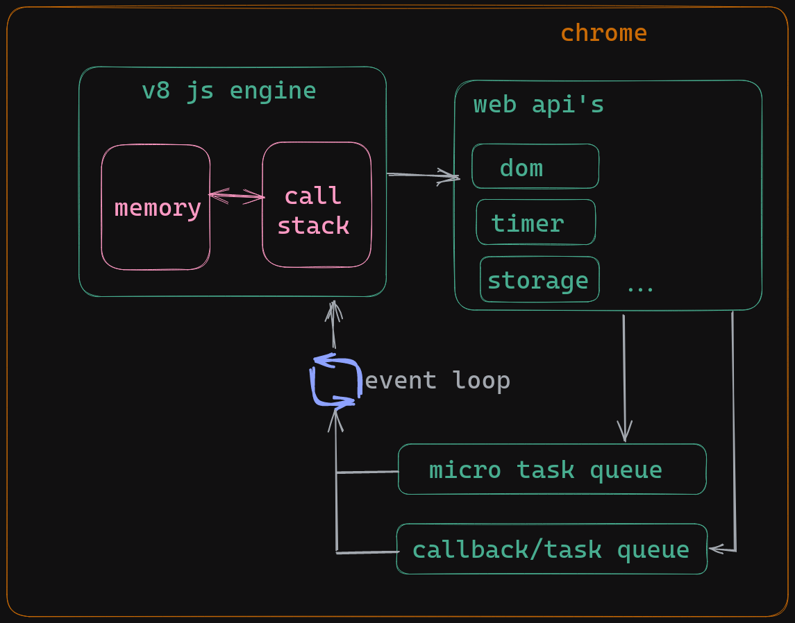
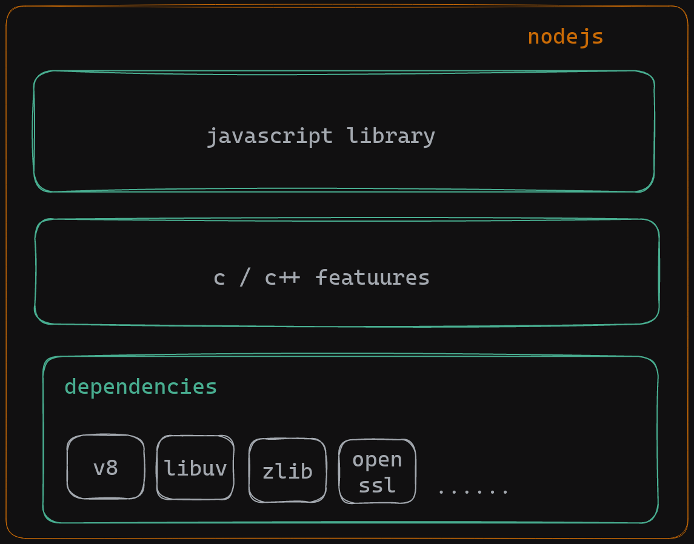

# Node.js

- open source
- cross-platform
- javascript runtime environment

## Installation

- [Node.js](https://nodejs.org/en/download/)

## chrome v8 engine

- javascript engine is a program that executes javascript code
- js code we write is not understood by the computer
- js engine is a program converts js code to machine code
- js engine is developed by browser vendors
  - v8 engine is developed by google
  - spidermonkey is developed by mozilla
  - JavaScriptCore is developed by apple
- V8 is Google's open source JavaScript engine.
- V8 implements ECMAScript as specified in ECMA-262.
- V8 is written in C++ and is used in Google Chrome , the open source browser from Google.
- V8 can run standalone, or can be embedded into any C++ application.

## JavaScript runtime:

- js runtime is environment which provides all the necessary components in order to use and run javascript program.
- every browser have js runtime
- and js engine is one component in js runtime

- high level overview of google chrome js runtime.

  

- rough overview of nodejs runtime

  

## executing js with nodejs

- node repl(Read-Eval-Print-Loop)
- executing js file in cli (node filename.js)
- `node --watch filename.js` (watch mode) is used to watch the file and execute the file when there is any change in the file.
